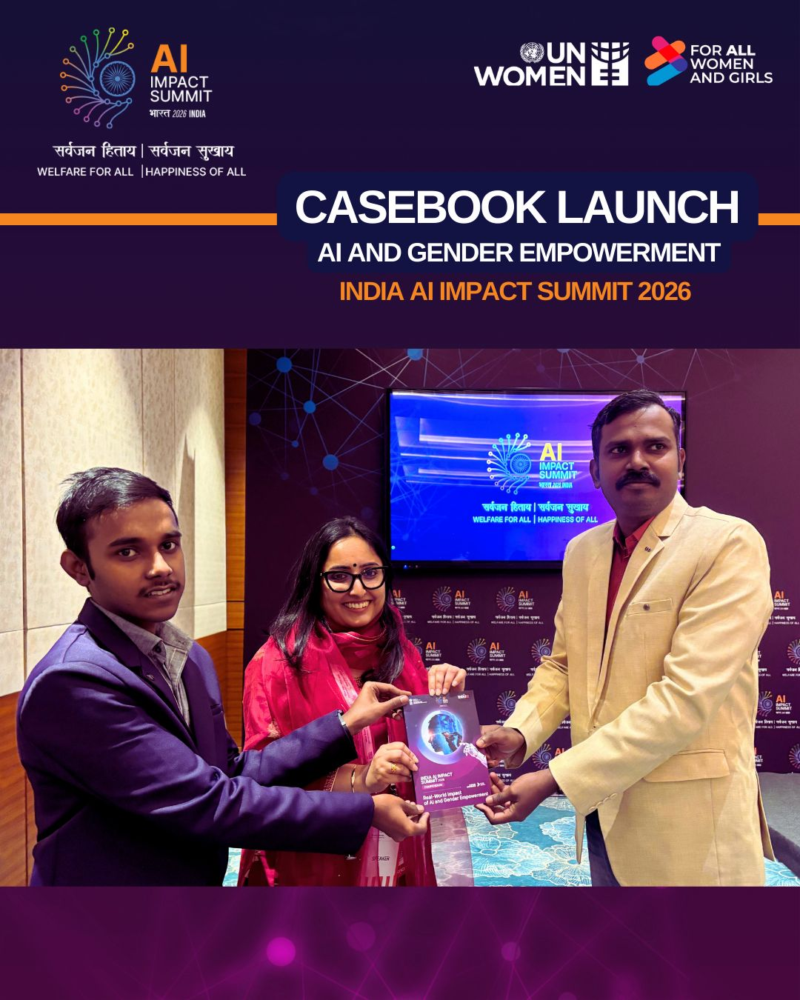

# NariRaksha

### Gender-Responsive AI for Women's Safety

<p align="center">
  
</p>

<p align="center">
  <strong>AI for Social Good • Women's Safety • Responsible AI • Smart Cities • Gender Empowerment</strong>
</p>

<p align="center">
  <a href="https://nariraksha-ai.github.io/"></a>
  <a href="https://github.com/NariRaksha-AI"></a>
  
  
</p>

---

## About NariRaksha

NariRaksha is a gender-responsive AI initiative designed to demonstrate how Artificial Intelligence can strengthen women's safety through responsible, transparent, and human-centered technologies.

The project combines:

* Geospatial Analytics
* Computer Vision
* Multilingual Natural Language Processing
* Risk Identification
* Incident Reporting
* Explainable AI Dashboards
* Ethical AI Governance

to support proactive safety planning and informed decision-making in urban environments.

---

# Recognition & Global Selection

## India AI Impact Summit 2026

NariRaksha was selected for publication in the:

### "India AI Impact Summit 2026 Casebook on AI and Gender Empowerment"

A collaborative initiative involving:

* IndiaAI Mission
* Ministry of Electronics and Information Technology (MeitY), Government of India
* UN Women

### Selection Highlights

| Metric                       | Value                   |
| ---------------------------- | ----------------------- |
| Global Submissions Received  | 235+                    |
| Multi-Stage Technical Review | ✓                       |
| Final Applications Selected  | 23                      |
| Publication Status           | Selected & Published    |
| Category                     | AI & Gender Empowerment |

---

# Featured Chapter

### NariRaksha: Gender-Responsive AI for Women's Safety

#### Authors

* Vikhram S
* Jeffin Gracewell J

### Core Focus Areas

* Safer Urban Mobility
* AI-Assisted Risk Identification
* Women's Safety Intelligence
* Explainable AI
* Responsible AI Governance
* Gender-Inclusive Smart Cities

---

# Why This Website Exists

Most research papers, policy reports, white papers, and conference proceedings are rarely read by the general public.

This platform transforms a published AI case study into an accessible, visual, and public-friendly experience.

The objective is simple:

### Research → Awareness

### Awareness → Understanding

### Understanding → Impact

### Impact → Safer Communities

---

# Vision

NariRaksha explores how AI can assist stakeholders in identifying emerging safety risks through:

### Geospatial Intelligence

Mapping high-risk areas and identifying recurring safety patterns.

### Computer Vision

Detecting unusual activities and environmental safety concerns.

### Multilingual NLP

Understanding citizen reports and distress signals across multiple languages.

### Risk Forecasting

Identifying safety vulnerabilities before incidents escalate.

### Decision Support

Providing explainable insights for authorities and urban administrators.

### Responsible AI

Embedding privacy, transparency, accountability, fairness, and inclusivity throughout the system lifecycle.

---

# Impact Areas

* Women's Safety
* Smart Cities
* AI for Social Good
* Urban Analytics
* Public Policy
* Responsible AI
* Digital Governance
* Sustainable Development Goal 5 (Gender Equality)

---

# Project Journey

```text
Idea
  ↓
Research
  ↓
Case Study Development
  ↓
Technical Evaluation
  ↓
India AI Impact Summit Selection
  ↓
Casebook Publication
  ↓
Public Awareness Website
  ↓
Community Impact
```

---

# Technology Stack

| Technology     | Usage                   |
| -------------- | ----------------------- |
| Next.js        | Frontend Framework      |
| React          | User Interface          |
| TypeScript     | Application Development |
| Tailwind CSS   | Styling                 |
| GitHub Pages   | Deployment              |
| GitHub Actions | CI/CD                   |

---

# Website Features

* Modern Responsive Design
* Public-Friendly Storytelling
* Research Simplification
* Interactive User Experience
* Mobile Optimization
* Accessibility Focus
* Open Source Deployment

---

# Responsible AI Principles

NariRaksha follows the principles of:

* Human-Centered AI
* Privacy by Design
* Fairness
* Transparency
* Explainability
* Accountability
* Inclusivity
* Bias Monitoring
* Ethical Governance

---

# Featured In

India AI Impact Summit 2026

Government of India • IndiaAI Mission • MeitY • UN Women

> AI and Gender Empowerment Casebook 2026

---

# Author

## Vikhram S

Electronics and Communication Engineering (ECE)

Artificial Intelligence Researcher & Open Source Developer

### Areas of Interest

* Artificial Intelligence
* Machine Learning
* Natural Language Processing
* Vision-Language Models (VLMs)
* Small Language Models (SLMs)
* Medical AI
* Radiology AI
* Responsible AI

### Open Source Contributions

#### indianconstitution

A Python NLP package focused on constitutional and legal text processing.

~26,000+ downloads across package ecosystems.

---

# Connect

### Website

🌐 https://nariraksha-ai.github.io/

### LinkedIn

💼 https://www.linkedin.com/in/vikhram-s/

### ORCID

🧑‍🔬 https://orcid.org/0009-0002-5300-7591

### Hugging Face

🤗 https://huggingface.co/Vikhram-S

🤗 https://huggingface.co/vikhram-labs

### PyPI

📦 https://pypi.org/user/Vikhram_S/

📦 https://pypi.org/project/indianconstitution/

---

# Repository Statistics


---

# Citation

```bibtex
@misc{nariraksha2026,
  title={NariRaksha: Gender-Responsive AI for Women's Safety},
  author={Vikhram S and Jeffin Gracewell J},
  year={2026},
  note={Published in India AI Impact Summit 2026 Casebook on AI and Gender Empowerment},
  publisher={IndiaAI, MeitY and UN Women}
}
```

---

# Disclaimer

This project is intended for educational, awareness, research, and public-interest purposes.

The website presents a gender-responsive AI framework focused on improving understanding of how responsible AI can contribute to safer public spaces for women.

Any future operational deployment should comply with applicable laws, privacy requirements, ethical standards, and institutional governance frameworks.

---

# License

MIT License

Copyright (c) 2026 Vikhram S

---

<p align="center">
  <strong>Building Safer Cities Through Responsible AI</strong>
</p>

<p align="center">
  <strong>Empowering Women Through Technology</strong>
</p>

<p align="center">
  <strong>Advancing AI for Social Good</strong>
</p>
